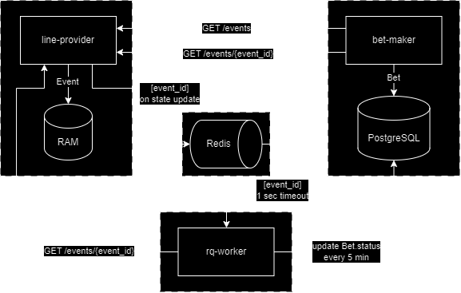

# BSW Test
Service images are based on `./common` which in turn is based on `python:3.10-alpine`.

Line-provider service accepts requests on listing and updating `event` entries, storing them in-memory. Every time an `event.state` gets updated a message is published to `RedisQueue`.

Rq-worker listens to given queue (1 sec int.) and updates related `bet` entries in PostgreSQL DB. Every 5 min worker fetches related event ids and gets corresponding `event.state` values, then updates related entries in PostgreSQL DB.

Bet-maker service accepts requests on listing relevant `event` entries, listing and creating `bet` entries. Stores `bet` entries in a PostgreSQL DB, fetching events from line-provider.

## How to use
**Build:**
```
docker build ./common -t common
docker compose up --build
```

**Line-provider**: http://localhost:8080/docs

**Bet-maker**: http://localhost:8081/docs

---
